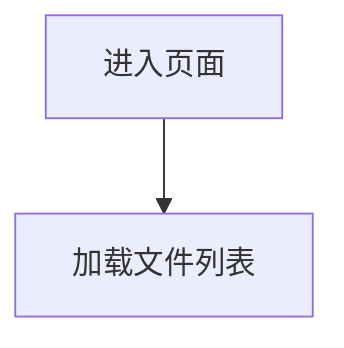

这是一个全面的 PRD 模板，旨在满足"优秀" PRD 的标准。它在高层战略与具体技术需求之间取得平衡，并包含优先级划分和版本控制的章节。

---

# PRD：[功能/项目名称]

| **属性** | **详情** |
| --- | --- |
| **状态** | `草稿` / `评审中` / `已批准` / `开发中` |
| **负责人 (PM)** | @姓名 |
| **技术负责人** | @姓名 |
| **设计师** | @姓名 |
| **测试负责人** | @姓名 |
| **目标发布日期** | YYYY-MM-DD（例如 v2.4 或 Q3 发布） |
| **最后更新** | YYYY-MM-DD |

---

## 1. 背景与战略（"为什么"）

### 1.1 问题陈述

*描述具体的用户痛点或业务问题。保持简洁。*

> **示例：** 目前，用户无法批量导出数据，只能逐个下载文件。这造成了很大的使用摩擦，是企业客户流失的主要原因之一。

### 1.2 机会与目标

*我们想要达成什么？*

* **主要目标：** [例如：将导出时间减少 80%]
* **次要目标：** [例如：提高"专业版"的采用率]

### 1.3 成功指标（KPI）

*发布后我们如何衡量成功？*

* [ ] 指标 1：[例如：导出错误率 < 1%]
* [ ] 指标 2：[例如：每周生成 500 次导出]

### 1.4 数据分析与埋点

*需要哪些埋点来衡量上述 KPI？*

| 事件名称 | 触发条件 | 属性 | 优先级 |
| --- | --- | --- | --- |
| `export_started` | 用户点击"下载" | file_count, total_size | **P0** |
| `export_completed` | 下载完成 | duration_ms, success | **P0** |
| `export_failed` | 导出出错 | error_type, file_count | **P0** |

---

## 2. 目标用户（"谁"）

### 2.1 目标受众

*这个功能是为谁设计的？*

* **主要用户画像：** [例如：数据分析师]
* **次要用户画像：** [例如：团队管理员]

### 2.2 用户故事

*格式：作为一个 [用户]，我想要 [行为]，以便 [收益]。*

| ID | 作为... | 我想要... | 以便... | 优先级 |
| --- | --- | --- | --- | --- |
| **US.1** | 管理员 | 一次选择多个文件 | 不必逐个点击 | **P0（必须）** |
| **US.2** | 管理员 | 将它们下载为 .ZIP 文件 | 保持本地文件夹整洁 | **P0（必须）** |
| **US.3** | 分析师 | 在选择前按日期筛选文件 | 只下载相关数据 | **P1（应该）** |

---

## 3. 解决方案（"是什么"）

### 3.1 功能需求

*系统必须支持的详细能力。*

| ID | 需求描述 | 验收标准 | 优先级 |
| --- | --- | --- | --- |
| **FR.1** | 批量选择 UI | 用户可以点击"全选"复选框。 | **P0** |
| **FR.2** | 导出限制 | 系统必须将导出上限设为 5GB 以防止超时。 | **P0** |
| **FR.3** | 后台处理 | 如果导出时间 > 5秒，显示进度条/提示。 | **P1** |

### 3.2 页面与业务流程

*按页面维度拆分需求，明确各页面的业务逻辑和功能模块。*

#### 3.2.1 页面清单

| 页面编号 | 页面名称 | 页面描述 | 入口 |
| --- | --- | --- | --- |
| **P.1** | 文件列表页 | 展示用户可导出的文件列表 | 主导航 |
| **P.2** | 导出确认页 | 确认导出选项并开始下载 | P.1 选择后 |
| **P.3** | 导出进度页 | 显示导出进度和状态 | P.2 确认后 |

---

#### 3.2.2 页面详情

##### P.1 文件列表页

**页面概述：** 用户进入后可查看所有可导出文件，支持筛选、排序和批量选择。

**业务流程图：**

* 使用mermaid 列出此页面的详细流程图，如下示例* 

**功能模块：**

| 模块 | 功能描述 | 优先级 |
| --- | --- | --- |
| 文件列表 | 分页展示文件名、大小、日期 | **P0** |
| 批量选择 | 全选/取消全选，单个选择 | **P0** |
| 筛选器 | 按日期、类型筛选文件 | **P1** |
| 排序 | 按名称、日期、大小排序 | **P1** |
| 导出按钮 | 触发导出流程 | **P0** |

---

*（按上述格式继续补充其他页面...）*

重要：页面详情列出的页面不能遗漏，与3.2.1 页面清单做验证。

### 3.3 边界情况与错误处理

*非正常路径场景下系统应如何表现？*

| 场景 | 预期行为 | 优先级 |
| --- | --- | --- |
| 用户选择的文件超过 5GB 限制 | 显示错误信息，阻止导出 | **P0** |
| 导出过程中失败 | 显示重试选项，记录错误 | **P0** |
| 用户在导出过程中断网 | 如可能则恢复下载，否则显示错误 | **P1** |
| 用户没有可导出的文件 | 禁用导出按钮，显示空状态 | **P1** |

### 3.4 技术与非功能需求

*性能、安全性和约束条件。*

* **性能：** 点击后 200ms 内必须开始生成导出。
* **安全：** 用户只能导出其拥有明确"读取"权限的数据。
* **无障碍：** 必须符合 WCAG 2.1 AA 标准。所有控件支持键盘导航，兼容屏幕阅读器。
* **本地化：** [在范围内 / 不在范围内] — 如在范围内，列出支持的语言环境。
* **移动端：** 此功能明确**不在**移动端网页版范围内。

---

## 4. 发布与执行（"如何"）

### 4.1 范围与阶段划分

| 阶段 | 范围 | 目标日期 |
| --- | --- | --- |
| **第一阶段（MVP）** | 仅支持 CSV 导出。最多 50 个文件。 | YYYY-MM-DD |
| **第二阶段（快速跟进）** | 支持 PDF 导出。无限制文件选择。 | YYYY-MM-DD |

* **不在范围内：** 将导出通过邮件发送给用户（目前仅支持下载）。

### 4.2 发布策略

* **功能开关：** [例如：`enable_bulk_export`]
* **发布计划：** [例如：2 周内从 5% → 25% → 100%]
* **回滚触发条件：** [例如：错误率 > 5% 或发现 P0 级别 bug]
* **回滚方案：** 禁用功能开关，通知受影响的用户。

### 4.3 依赖项

* [ ] 需要后端 API 接口 `POST /api/v1/bulk-export`（状态：进行中）
* [ ] 需要法务部门批准数据导出隐私政策。

### 4.4 测试要求

* **单元测试：** [例如：覆盖所有导出工具函数]
* **集成测试：** [例如：使用模拟数据的 API 接口测试]
* **端到端测试：** [例如：在预发布环境中完整的导出流程]
* **UAT 标准：** [例如：QA 签署所有 P0 用户故事]
* **性能测试：** [例如：100 个并发导出的负载测试]

---

## 5. 问题、风险与决策记录

### 5.1 待解决问题

* *问：如果用户在下载准备过程中关闭浏览器会怎样？*
* *答：（待定）*

### 5.2 已知风险

* *风险：* 高峰期大量用户同时导出可能造成服务器高负载。
* *缓解措施：* 实施速率限制（每用户每小时 10 次导出）。

### 5.3 决策记录

*记录重大变更，避免日后出现"当时为什么这样做？"的疑问。*

* *日期：YYYY-MM-DD* - 决定从 MVP 中移除 PDF 支持以赶上 Q3 截止日期。由 [姓名] 批准。

---

### 如何有效使用此模板：

1. **删除不需要的部分：** 如果还没有"风险"内容，删除该章节或标记为待定。
2. **使用"P"优先级系统：** 始终对需求进行优先级划分（P0 = 关键，P1 = 重要，P2 = 锦上添花）。
3. **保持文档活力：** 开发过程中范围发生变化时，更新"决策记录"。
