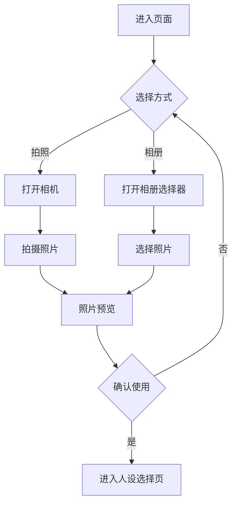
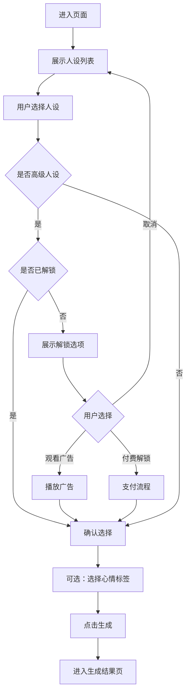
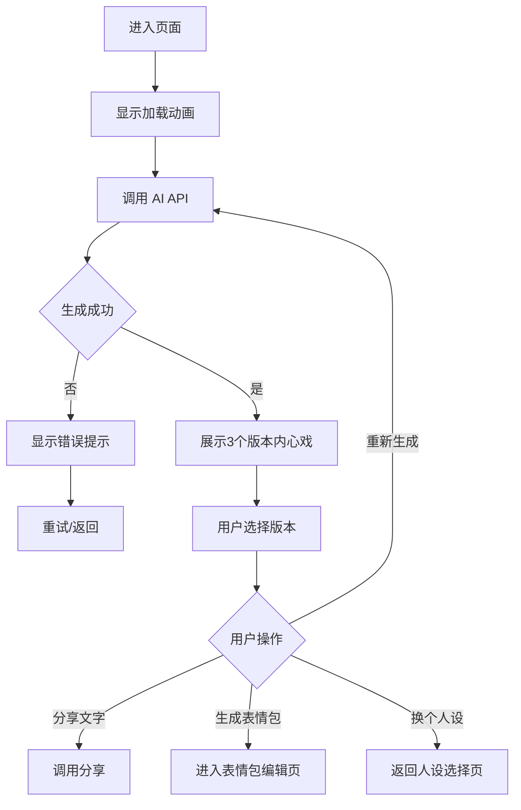
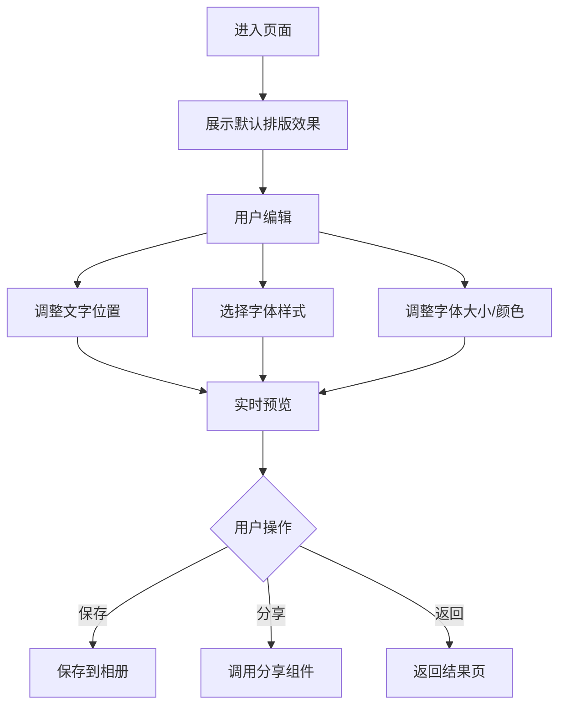
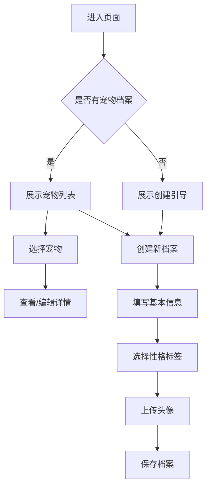
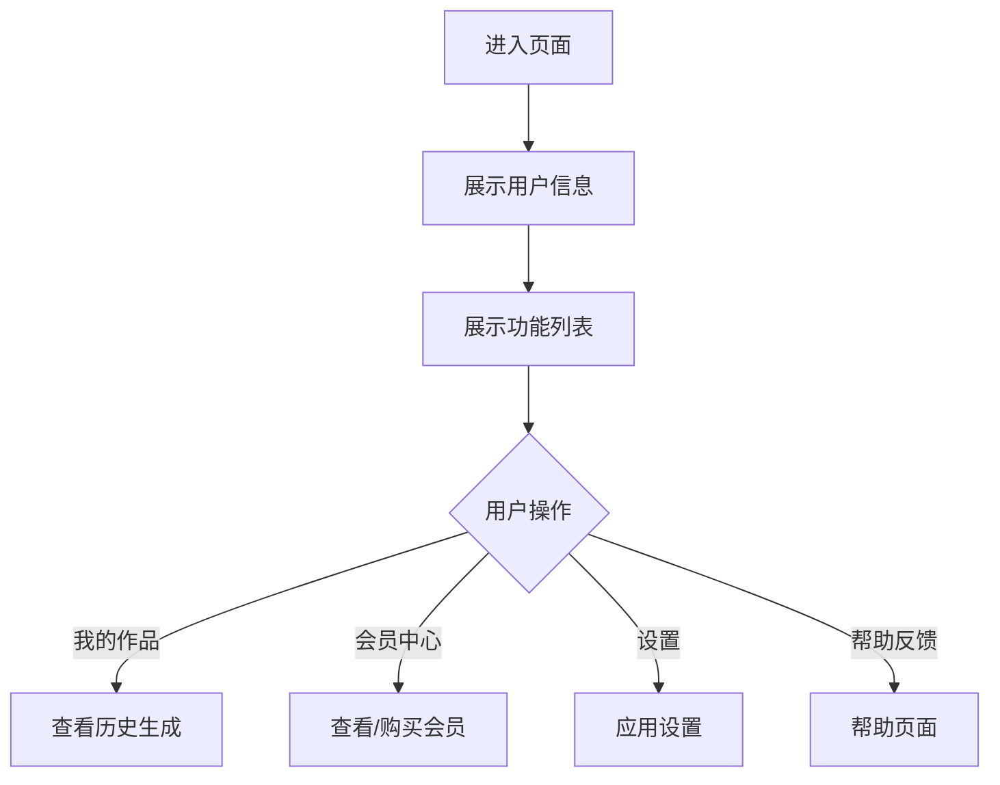

# PRD：宠灵感 · PetSoul

| **属性** | **详情** |
| --- | --- |
| **状态** | `草稿` |
| **负责人 (PM)** | @待定 |
| **技术负责人** | @待定 |
| **设计师** | @待定 |
| **测试负责人** | @待定 |
| **目标发布日期** | 待定（MVP 预计 4-6 周） |
| **最后更新** | 2026-01-23 |

---

## 1. 背景与战略（"为什么"）

### 1.1 问题陈述

养宠人群普遍存在"拟人化想象"的心理需求——想知道自己的宠物此刻在想什么。目前市场上缺乏一款能够结合 AI 图像识别与个性化文案生成的产品，来满足用户对宠物内心世界的好奇心和情感投射需求。

> **示例：** 用户看到自家猫盯着墙角发呆，很想知道它在想什么，但现有工具无法提供有趣且个性化的"翻译"。

### 1.2 机会与目标

* **主要目标：** 打造一款基于多模态 AI 的宠物情绪解码工具，让用户能够快速生成有趣的宠物内心独白
* **次要目标：** 通过社交裂变机制实现用户自发传播，建立宠物社交内容生态

### 1.3 成功指标（KPI）

* [ ] DAU：MVP 上线 30 天内达到 10,000
* [ ] 分享率：用户生成内容的分享率 > 30%
* [ ] 留存率：次日留存 > 25%，7 日留存 > 10%
* [ ] 付费转化：高级人设解锁付费转化率 > 5%

### 1.4 数据分析与埋点

| 事件名称 | 触发条件 | 属性 | 优先级 |
| --- | --- | --- | --- |
| `photo_uploaded` | 用户上传/拍摄照片 | source(camera/album), file_size | **P0** |
| `persona_selected` | 用户选择人设模板 | persona_id, is_premium | **P0** |
| `content_generated` | AI 生成内容完成 | generation_time_ms, version_count | **P0** |
| `content_shared` | 用户分享生成内容 | platform, content_type(meme/text) | **P0** |
| `pet_profile_created` | 用户创建宠物档案 | pet_type, personality_tags | **P1** |
| `premium_unlocked` | 用户解锁高级功能 | unlock_type(ad/pay), feature_id | **P0** |

---

## 2. 目标用户（"谁"）

### 2.1 目标受众

* **主要用户画像：** 18-35 岁的年轻养宠人群，活跃于社交媒体（小红书、朋友圈、微博），喜欢分享宠物日常
* **次要用户画像：** 宠物爱好者（云养宠用户），喜欢看萌宠内容但暂未养宠

### 2.2 用户故事

| ID | 作为... | 我想要... | 以便... | 优先级 |
| --- | --- | --- | --- | --- |
| **US.1** | 猫主人 | 上传一张猫咪照片并获得有趣的内心独白 | 满足我对猫咪想法的好奇心 | **P0（必须）** |
| **US.2** | 社交达人 | 一键生成带文字的表情包图片 | 方便分享到朋友圈/小红书 | **P0（必须）** |
| **US.3** | 资深铲屎官 | 为我的宠物建立专属性格档案 | 生成更符合它性格的内心戏 | **P1（应该）** |
| **US.4** | 多宠家庭用户 | 上传多只宠物的合照并生成对话 | 看到它们"吵架"或"密谋"的有趣场景 | **P1（应该）** |
| **US.5** | 付费用户 | 解锁更多有趣的人设模板 | 获得更丰富的文案风格选择 | **P2（锦上添花）** |

---

## 3. 解决方案（"是什么"）

### 3.1 功能需求

| ID | 需求描述 | 验收标准 | 优先级 |
| --- | --- | --- | --- |
| **FR.1** | 照片上传/拍摄 | 支持从相册选择或直接拍摄，支持常见图片格式（JPG/PNG/HEIC） | **P0** |
| **FR.2** | AI 图像识别 | 能准确识别宠物品种、表情、动作、环境背景 | **P0** |
| **FR.3** | 内心独白生成 | 基于图像识别结果和选定人设，生成 3 个不同版本的内心独白 | **P0** |
| **FR.4** | 人设模板选择 | 提供至少 5 种基础人设（高冷总裁、碎碎念大妈、文艺青年、热血少年、毒舌吐槽） | **P0** |
| **FR.5** | 表情包生成 | 将选中的文案自动排版到图片上，支持多种字体和样式 | **P0** |
| **FR.6** | 一键分享 | 支持分享到微信、小红书等主流社交平台 | **P0** |
| **FR.7** | 宠物档案管理 | 用户可创建宠物档案（名字、品种、性格标签） | **P1** |
| **FR.8** | 高级人设解锁 | 通过观看广告或付费解锁特殊人设（甄嬛体、赛博朋克体等） | **P1** |
| **FR.9** | 主子朋友圈 | 生成模拟朋友圈界面，包含虚拟"宠物好友"评论 | **P2** |
| **FR.10** | 宠物信件推送 | 定期推送 AI 生成的"主子来信" | **P2** |

### 3.2 页面与业务流程

#### 3.2.1 页面清单

| 页面编号 | 页面名称 | 页面描述 | 入口 |
| --- | --- | --- | --- |
| **P.1** | 首页 | 展示核心功能入口和精选内容 | 应用启动 |
| **P.2** | 拍摄/上传页 | 拍照或选择相册照片 | P.1 主按钮 |
| **P.3** | 人设选择页 | 选择内心戏的文风人设 | P.2 照片确认后 |
| **P.4** | 生成结果页 | 展示 AI 生成的内心独白和表情包 | P.3 确认后 |
| **P.5** | 表情包编辑页 | 编辑文字样式和位置 | P.4 选择编辑 |
| **P.6** | 宠物档案页 | 管理宠物信息和历史记录 | P.1 侧边栏 |
| **P.7** | 个人中心 | 账户设置、会员状态、历史作品 | P.1 侧边栏 |

---

#### 3.2.2 页面详情

##### P.1 首页

**页面概述：** 用户打开应用后的第一屏，突出核心功能入口，展示精选用户生成内容激发创作欲望。

**业务流程图：**

```mermaid
flowchart TD
    A[打开应用] --> B{是否首次使用}
    B -->|是| C[展示引导页]
    B -->|否| D[展示首页]
    C --> D
    D --> E[点击"开始解读"]
    E --> F[进入拍摄/上传页]
    D --> G[点击精选内容]
    G --> H[查看详情/生成同款]
```

**功能模块：**

| 模块 | 功能描述 | 优先级 |
| --- | --- | --- |
| 核心 CTA 按钮 | "解读主子心声"大按钮，进入拍摄流程 | **P0** |
| 精选内容流 | 展示热门/优质用户生成内容 | **P1** |
| 快捷入口 | 宠物档案、历史记录快捷入口 | **P1** |
| 每日推荐 | 推荐当日热门人设模板 | **P2** |

---

##### P.2 拍摄/上传页

**页面概述：** 用户通过拍照或从相册选择照片，作为 AI 解读的输入。

**业务流程图：**



**功能模块：**

| 模块 | 功能描述 | 优先级 |
| --- | --- | --- |
| 相机模块 | 支持拍照，可切换前后摄像头 | **P0** |
| 相册选择 | 支持从系统相册选择图片 | **P0** |
| 照片预览 | 预览选中的照片，支持重新选择 | **P0** |
| 裁剪功能 | 支持简单裁剪调整 | **P1** |

---

##### P.3 人设选择页

**页面概述：** 用户选择希望生成的内心戏文风，可同时选择心情标签增强效果。

**业务流程图：**



**功能模块：**

| 模块 | 功能描述 | 优先级 |
| --- | --- | --- |
| 人设卡片列表 | 展示所有可用人设，标注免费/高级 | **P0** |
| 人设预览 | 点击可预览该人设的示例文案 | **P0** |
| 心情标签选择 | 可选的心情标签（得意、无聊、饿了等） | **P1** |
| 解锁弹窗 | 高级人设的解锁选项（广告/付费） | **P1** |

---

##### P.4 生成结果页

**页面概述：** 展示 AI 生成的 3 个版本内心独白，用户可选择最满意的进行分享或编辑为表情包。

**业务流程图：**



**功能模块：**

| 模块 | 功能描述 | 优先级 |
| --- | --- | --- |
| 内心戏卡片 | 展示 3 个不同版本的内心独白 | **P0** |
| 版本切换 | 左右滑动切换不同版本 | **P0** |
| 快速分享 | 复制文字或直接分享 | **P0** |
| 生成表情包 | 将选中文案合成到图片上 | **P0** |
| 重新生成 | 不满意可重新生成（有次数限制） | **P1** |
| 收藏功能 | 收藏喜欢的生成结果 | **P2** |

---

##### P.5 表情包编辑页

**页面概述：** 用户可调整文字在图片上的位置、字体、颜色等，生成最终表情包。

**业务流程图：**



**功能模块：**

| 模块 | 功能描述 | 优先级 |
| --- | --- | --- |
| 文字拖拽 | 拖拽调整文字在图片上的位置 | **P0** |
| 字体选择 | 提供 5+ 种网红字体 | **P0** |
| 样式调整 | 字号、颜色、描边、阴影 | **P1** |
| 滤镜效果 | 为图片添加简单滤镜 | **P2** |
| 水印设置 | 添加/隐藏品牌水印 | **P1** |

---

##### P.6 宠物档案页

**页面概述：** 用户管理自己的宠物信息，建立专属档案以获得更个性化的内心戏。

**业务流程图：**



**功能模块：**

| 模块 | 功能描述 | 优先级 |
| --- | --- | --- |
| 宠物列表 | 展示所有已创建的宠物档案 | **P1** |
| 档案创建 | 输入名字、选择品种、性格标签 | **P1** |
| 档案编辑 | 修改宠物信息 | **P1** |
| 历史作品 | 该宠物的历史生成记录 | **P2** |

---

##### P.7 个人中心

**页面概述：** 用户账户管理、会员状态查看、设置等。

**业务流程图：**



**功能模块：**

| 模块 | 功能描述 | 优先级 |
| --- | --- | --- |
| 用户信息 | 头像、昵称、会员状态 | **P1** |
| 我的作品 | 历史生成的所有内容 | **P1** |
| 会员中心 | 会员权益说明和购买入口 | **P1** |
| 应用设置 | 通知、隐私等设置 | **P2** |

---

### 3.3 边界情况与错误处理

| 场景 | 预期行为 | 优先级 |
| --- | --- | --- |
| 上传的图片中没有识别到宠物 | 提示"未检测到毛孩子，换张照片试试？"，允许重新上传 | **P0** |
| AI 生成超时（>15秒） | 显示重试按钮，提示"主子正在酝酿措辞，请稍后重试" | **P0** |
| API 调用失败 | 显示友好错误提示，提供重试选项，记录错误日志 | **P0** |
| 用户网络断开 | 检测网络状态，提示检查网络连接 | **P0** |
| 图片过大（>10MB） | 自动压缩或提示用户选择较小的图片 | **P1** |
| 免费用户达到每日生成上限 | 提示升级会员或明日再试 | **P1** |
| 识别出敏感/不当内容 | 拒绝生成，提示"这张照片不太适合哦" | **P0** |

### 3.4 技术与非功能需求

* **性能：** 图片上传后 5 秒内开始返回生成结果；表情包生成 < 2 秒
* **可用性：** 核心 API 可用性 > 99.5%
* **安全：**
  - 用户上传的图片仅用于当次生成，不永久存储（除非用户主动保存）
  - API 调用需要身份验证和速率限制
* **隐私：** 符合《个人信息保护法》要求，明确告知数据使用方式
* **无障碍：** 支持基本的无障碍功能（图片替代文字、大字体模式）
* **本地化：** MVP 仅支持简体中文；后续考虑繁体中文、英文
* **平台：**
  - 第一阶段：微信小程序
  - 第二阶段：iOS/Android App

---

## 4. 发布与执行（"如何"）

### 4.1 范围与阶段划分

| 阶段 | 范围 | 目标日期 |
| --- | --- | --- |
| **第一阶段（MVP）** | 核心拍照解读功能、5 种基础人设、表情包生成、基础分享 | 待定 |
| **第二阶段** | 宠物档案、高级人设（付费/广告解锁）、主子朋友圈 | MVP + 4 周 |
| **第三阶段** | 宠物信件推送、社区功能、品牌合作模块 | 待定 |

* **不在范围内（MVP）：**
  - 视频解读功能
  - 多语言支持
  - 实体周边商城
  - 原生 App（先做小程序验证）

### 4.2 发布策略

* **灰度发布：** 内测邀请码 → 10% 用户 → 50% → 全量
* **回滚触发条件：**
  - API 错误率 > 10%
  - 用户投诉率突增
  - 发现内容安全问题
* **回滚方案：** 通过小程序版本控制回退到上一稳定版本

### 4.3 依赖项

* [ ] 多模态 AI API 接入（GPT-4o / Claude 3.5 Sonnet / 通义千问）
* [ ] 图片存储服务（阿里云 OSS / 腾讯云 COS）
* [ ] 微信小程序账号和资质审核
* [ ] 内容安全审核服务接入
* [ ] 支付功能接入（如需付费解锁）

### 4.4 测试要求

* **单元测试：** 覆盖核心业务逻辑（人设模板、文案合成）
* **接口测试：** AI API 调用的各种边界情况
* **端到端测试：** 完整的拍照→生成→分享流程
* **兼容性测试：** 主流机型和微信版本
* **性能测试：** 并发生成请求的响应时间
* **内容安全测试：** 各类边界图片的审核效果

---

## 5. 问题、风险与决策记录

### 5.1 待解决问题

* *问：AI API 成本如何控制？每次生成的成本大约多少？*
* *答：（待定，需要进行 API 成本核算）*

* *问：如何防止用户滥用（如批量调用、爬虫）？*
* *答：（待定，需要设计防刷策略）*

* *问：生成内容的版权归属如何界定？*
* *答：（待定，需法务确认）*

### 5.2 已知风险

| 风险 | 影响 | 缓解措施 |
| --- | --- | --- |
| API 成本过高导致亏损 | 高 | 设置每日免费次数限制，超出需观看广告或付费 |
| 工具属性强，用户留存低 | 中 | 引入宠物档案、信件推送等增加情感连接的机制 |
| 生成内容可能存在不当言论 | 高 | 接入内容安全审核，设置敏感词过滤 |
| 竞品快速模仿 | 中 | 快速迭代，建立用户数据壁垒（宠物档案） |

### 5.3 决策记录

* *日期：2026-01-23* - 决定 MVP 采用微信小程序形式，降低开发成本和获客门槛。
* *日期：2026-01-23* - 决定首批支持 5 种基础人设，高级人设作为付费点留到第二阶段。

---

## 附录：人设模板示例

| 人设名称 | 文风特点 | 示例文案 | 类型 |
| --- | --- | --- | --- |
| 高冷总裁 | 傲娇、嫌弃、王之蔑视 | "看什么看？朕的罐头迟到了三分钟。" | 免费 |
| 碎碎念大妈 | 唠叨、操心、家长里短 | "哎呀这地板又脏了，两脚兽天天不着家..." | 免费 |
| 文艺青年 | 伤春悲秋、诗意、小清新 | "阳光斜照在地毯上，我在想念那只隔壁的白猫..." | 免费 |
| 热血少年 | 中二、热血、梦想 | "总有一天，我要越过那扇窗，去看看外面的世界！" | 免费 |
| 毒舌吐槽 | 犀利、搞笑、网络热梗 | "就这？就这？铲屎官你是认真的吗？" | 免费 |
| 甄嬛体 | 古风宫斗、华丽辞藻 | "本宫今日甚是疲乏，那小鱼干着实不够新鲜..." | **高级** |
| 赛博朋克 | 科幻、机械、未来感 | "检测到生物体靠近，启动防御协议：装睡。" | **高级** |
