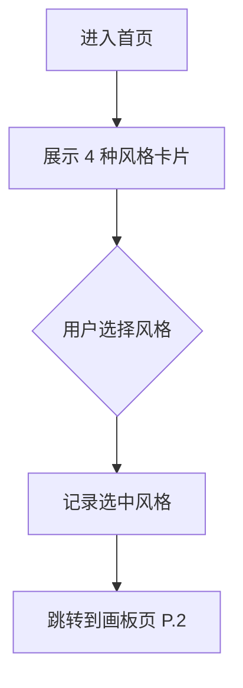
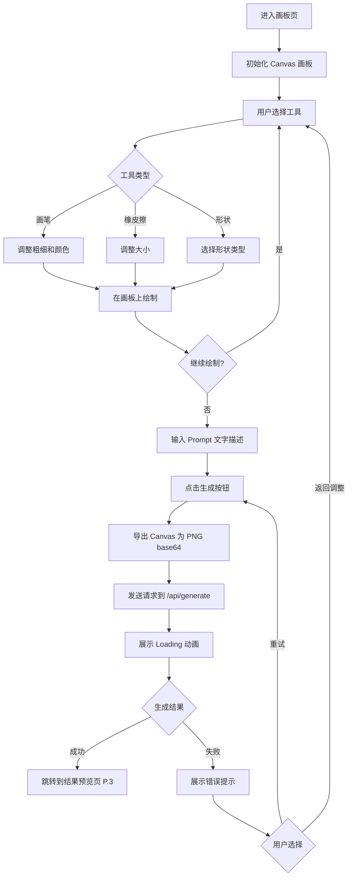
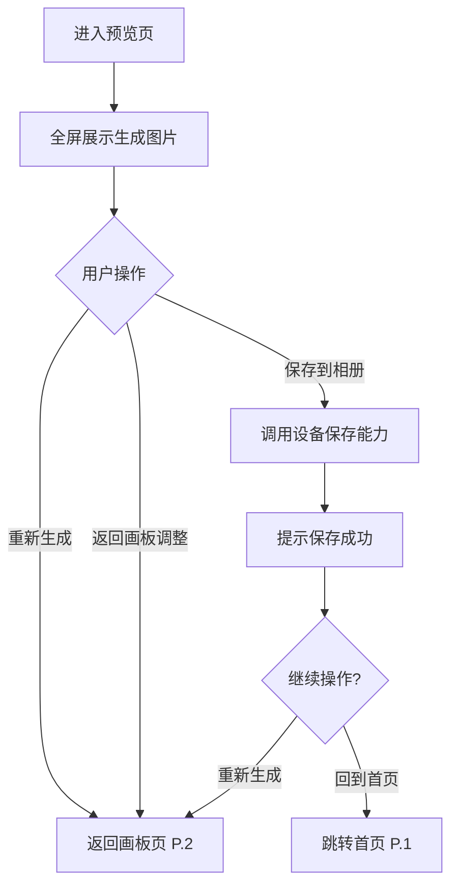

# PRD：Pygmalion - AI 简笔画生成精美图片

| **属性** | **详情** |
| --- | --- |
| **状态** | `草稿` |
| **负责人 (PM)** | @待定 |
| **技术负责人** | @待定 |
| **设计师** | @待定 |
| **测试负责人** | @待定 |
| **目标发布日期** | 待定（MVP） |
| **最后更新** | 2026-01-27 |

---

## 1. 背景与战略（"为什么"）

### 1.1 问题陈述

大多数人没有专业的绘画功底，却常常有天马行空的视觉创意想要表达。现有的 AI 绘图工具（如 Midjourney、Stable Diffusion）主要依赖纯文字 prompt 驱动，用户难以精确控制构图、色彩分布和空间布局。用户脑海中的画面无法通过文字完整传达，导致生成结果与预期偏差大，需要反复调整 prompt，体验门槛高、效率低。

### 1.2 机会与目标

* **主要目标：** 让零绘画基础的用户通过简笔画 + 色块涂抹 + 文字描述的方式，一键生成风格化精美图片，将"所画即所得"的创作门槛降到最低。
* **次要目标：** 验证"草图引导 AI 生图"在移动端场景下的用户接受度和使用频次，为后续商业化探路。

### 1.3 成功指标（KPI）

* [ ] 指标 1：MVP 上线后首月 DAU ≥ 500
* [ ] 指标 2：单用户平均生成次数 ≥ 3 次/周
* [ ] 指标 3：生成成功率 ≥ 95%（排除网络超时）
* [ ] 指标 4：用户保存图片率 ≥ 60%（生成后点击保存的比例）

### 1.4 数据分析与埋点

| 事件名称 | 触发条件 | 属性 | 优先级 |
| --- | --- | --- | --- |
| `style_selected` | 用户在首页选择风格卡片 | style_id, style_name | **P0** |
| `canvas_draw_start` | 用户在画板上开始绘制 | tool_type (pen/eraser/shape) | **P1** |
| `generate_clicked` | 用户点击"生成"按钮 | style_id, has_prompt, canvas_has_content | **P0** |
| `generate_success` | AI 生成成功返回图片 | duration_ms, model_used | **P0** |
| `generate_failed` | AI 生成失败 | error_type, duration_ms | **P0** |
| `image_saved` | 用户点击"保存到相册" | style_id | **P0** |
| `image_regenerate` | 用户点击"重新生成" | style_id, attempt_count | **P1** |

---

## 2. 目标用户（"谁"）

### 2.1 目标受众

* **主要用户画像：** 对绘画感兴趣但缺乏专业技能的普通用户（18-35 岁），希望将脑海中的创意快速可视化，用于社交分享、头像制作、创意表达等场景。
* **次要用户画像：** 设计师/插画师，将 Pygmalion 作为快速概念草图工具，用简笔画快速验证构图和配色方向。

### 2.2 用户故事

| ID | 作为... | 我想要... | 以便... | 优先级 |
| --- | --- | --- | --- | --- |
| **US.1** | 普通用户 | 在手机上用手指画一个简单的草图 | 不需要专业绘画工具也能表达创意 | **P0（必须）** |
| **US.2** | 普通用户 | 选择一个预设的艺术风格 | 不需要编写复杂的 prompt 就能得到风格化图片 | **P0（必须）** |
| **US.3** | 普通用户 | 用色块涂抹表达颜色意图（如天空涂蓝色） | AI 能理解我想要的颜色分布 | **P0（必须）** |
| **US.4** | 普通用户 | 输入一段文字描述补充细节 | 进一步精确控制生成效果 | **P0（必须）** |
| **US.5** | 普通用户 | 一键将生成的图片保存到手机相册 | 方便分享到社交平台 | **P0（必须）** |
| **US.6** | 普通用户 | 对不满意的结果返回画板调整后重新生成 | 迭代优化直到满意 | **P1（应该）** |
| **US.7** | 普通用户 | 撤销/重做画板操作 | 修正绘画过程中的失误 | **P0（必须）** |

---

## 3. 解决方案（"是什么"）

### 3.1 功能需求

| ID | 需求描述 | 验收标准 | 优先级 |
| --- | --- | --- | --- |
| **FR.1** | 风格选择 | 提供 4 种预设风格卡片（动漫/卡通、水彩/油画、像素风、写实/摄影），用户点击即可选中，选中状态有明确视觉反馈 | **P0** |
| **FR.2** | Canvas 画板 | 基于 Fabric.js 实现全屏画板，支持触摸绘画，适配移动端手势操作 | **P0** |
| **FR.3** | 画笔工具 | 自由画笔支持粗细调节（至少 3 档）和颜色选择（至少 12 色调色板） | **P0** |
| **FR.4** | 橡皮擦工具 | 擦除工具支持大小调节，擦除区域恢复为透明/白色 | **P0** |
| **FR.5** | 色块涂抹 | 用户选择颜色后可用粗画笔涂抹区域表达颜色意图 | **P0** |
| **FR.6** | 形状工具 | 支持矩形、圆形、三角形的快速绘制 | **P0** |
| **FR.7** | 撤销/重做 | 支持操作历史的撤回和恢复，至少保留 20 步历史 | **P0** |
| **FR.8** | Prompt 输入 | 文字输入框，用户可输入文字描述画面细节，最大 500 字符 | **P0** |
| **FR.9** | AI 生成 | 将画板内容导出为图片 + 风格 + prompt 发送后端，调用 Gemini API 生成图片 | **P0** |
| **FR.10** | 结果预览 | 全屏展示生成结果，支持缩放查看细节 | **P0** |
| **FR.11** | 保存到相册 | 将生成图片下载保存到用户设备 | **P0** |

### 3.2 页面与业务流程

#### 3.2.1 页面清单

| 页面编号 | 页面名称 | 页面描述 | 入口 |
| --- | --- | --- | --- |
| **P.1** | 首页（风格选择页） | 展示预设风格卡片供用户选择 | 应用入口 |
| **P.2** | 画板页 | Canvas 绘制区域 + 工具栏 + Prompt 输入 | P.1 选择风格后 |
| **P.3** | 结果预览页 | 全屏展示 AI 生成的图片，提供保存和重新生成操作 | P.2 点击生成后 |

---

#### 3.2.2 页面详情

##### P.1 首页（风格选择页）

**页面概述：** 用户进入应用后的首屏，展示 4 种预设风格卡片，用户选择一种风格后进入画板页。页面应简洁直观，突出风格预览效果。

**业务流程图：**

**功能模块：**

| 模块 | 功能描述 | 优先级 |
| --- | --- | --- |
| 风格卡片列表 | 以卡片形式展示 4 种预设风格，每张卡片包含风格名称 + 示例图片预览 | **P0** |
| 风格选择交互 | 点击卡片选中，选中后自动跳转到画板页，并携带风格参数 | **P0** |

**风格定义：**

| 风格 ID | 风格名称 | Prompt 模板前缀 |
| --- | --- | --- |
| `anime` | 动漫/卡通 | `anime style, cel shading, vibrant colors, clean lines, studio ghibli inspired` |
| `watercolor` | 水彩/油画 | `watercolor painting style, soft brush strokes, artistic, rich textures, gallery quality` |
| `pixel` | 像素风 | `pixel art style, retro game aesthetic, 16-bit, clean pixels, nostalgic` |
| `realistic` | 写实/摄影 | `photorealistic, high detail, natural lighting, professional photography, 8k quality` |

---

##### P.2 画板页

**页面概述：** 核心交互页面。用户在 Canvas 画板上绘制草图和涂抹色块，使用底部工具栏切换工具、调整参数，页面底部或弹窗提供 Prompt 输入框，右上角提供"生成"按钮。

**业务流程图：**

**功能模块：**

| 模块 | 功能描述 | 优先级 |
| --- | --- | --- |
| Canvas 画板 | 基于 Fabric.js 的全屏 Canvas，支持触摸绘制，白色背景 | **P0** |
| 画笔工具 | 自由画笔，支持 3 档粗细（细/中/粗）和 12 色调色板 | **P0** |
| 橡皮擦工具 | 擦除工具，支持大小调节 | **P0** |
| 色块涂抹 | 选择颜色后用粗画笔模式涂抹区域（本质是大号画笔） | **P0** |
| 形状工具 | 支持矩形、圆形、三角形，拖拽绘制 | **P0** |
| 撤销/重做 | 工具栏中的撤销和重做按钮，至少支持 20 步 | **P0** |
| 清空画板 | 一键清空画板内容，需二次确认 | **P0** |
| 工具栏 | 底部固定工具栏，展示工具切换、参数调整面板 | **P0** |
| Prompt 输入 | 画板下方的文字输入框，最多 500 字符，placeholder 提示用户描述画面 | **P0** |
| 生成按钮 | 右上角或底部的主操作按钮，画板有内容时可点击 | **P0** |
| Loading 状态 | 生成过程中的全屏 Loading 动画，附带"AI 正在创作中"提示文案 | **P0** |
| 当前风格标识 | 页面顶部显示当前选中的风格名称，可点击返回首页切换 | **P1** |

**调色板定义：**

提供 12 种基础颜色：黑色、白色、红色、橙色、黄色、绿色、蓝色、紫色、粉色、棕色、灰色、青色。

---

##### P.3 结果预览页

**页面概述：** 全屏展示 AI 生成的图片结果，提供保存和重新生成操作。用户可以选择保存满意的图片或返回画板调整后重新生成。

**业务流程图：**

**功能模块：**

| 模块 | 功能描述 | 优先级 |
| --- | --- | --- |
| 图片全屏预览 | 全屏展示生成的图片，支持双指缩放查看细节 | **P0** |
| 保存到相册 | 点击按钮将图片保存到设备相册/下载到本地 | **P0** |
| 重新生成 | 使用相同的画板内容和参数重新生成一张新图片 | **P0** |
| 返回画板 | 返回画板页调整草图后重新生成 | **P0** |
| 回到首页 | 返回首页选择新风格重新开始 | **P1** |

---

### 3.3 边界情况与错误处理

| 场景 | 预期行为 | 优先级 |
| --- | --- | --- |
| 用户未绘制任何内容就点击生成 | 禁用生成按钮，或提示"请先在画板上绘制草图" | **P0** |
| AI 生成超时（>30 秒） | 显示超时提示，提供重试按钮 | **P0** |
| AI 生成接口返回错误 | 显示友好错误提示（"生成失败，请重试"），提供重试按钮 | **P0** |
| 网络断开 | 检测网络状态，提示"网络连接异常，请检查网络后重试" | **P0** |
| 画板内容过于简单（如只有一个点） | 允许生成，但 AI 可能返回质量较低的结果，不做前端拦截 | **P1** |
| 设备不支持 Canvas | 显示提示"当前浏览器不支持绘制功能，请使用 Chrome/Safari 最新版" | **P1** |
| 保存图片权限被拒绝 | 提示用户授权相册/下载权限，或提供长按保存引导 | **P1** |

### 3.4 非功能需求

**性能要求：**

* 画板操作延迟：触摸绘制响应 ≤ 16ms（60fps）
* 生成接口响应：目标 ≤ 15 秒，超时上限 30 秒
* 首屏加载时间：≤ 3 秒（3G 网络）

**安全要求：**

* Gemini API Key 仅在服务端持有，禁止暴露给前端
* 实施每日每用户生成次数限制（MVP 阶段：20 次/天，基于 IP + localStorage）
* 对用户输入的 prompt 进行基础长度校验（≤ 500 字符）

**移动端适配：**

* 移动端优先设计，支持 iOS Safari 和 Android Chrome
* Canvas 画板需处理 touch 事件、防误触
* 页面适配 375px ~ 430px 宽度的主流手机屏幕

---

## 4. 发布与执行（"如何"）

### 4.1 范围与阶段划分

| 阶段 | 范围 | 目标日期 |
| --- | --- | --- |
| **第一阶段（MVP）** | 4 种预设风格、Canvas 画板（画笔+橡皮擦+色块+形状）、撤销/重做、Prompt 输入、AI 生成（gemini-2.5-flash-image）、结果预览、保存图片、每日限额 | 待定 |

---

## 5. 问题、风险与决策记录

### 5.1 待解决问题

* *问：Vercel 免费版 Serverless Function 10 秒超时是否足够 Gemini 图像生成？*
  *答：Gemini 图像生成通常需要数秒，免费版可能不够。建议使用 Vercel Pro（60 秒超时）或考虑流式响应方案。*

* *问：每日生成限额如何在无登录系统下有效实施？*
  *答：MVP 阶段使用 IP + localStorage 组合方案，存在被绕过的风险，但对 MVP 可接受。后续版本引入用户系统后改为账户级限额。*

* *问：生成图片的分辨率选择？*
  *答：（待定）MVP 先使用默认分辨率，后续根据用户反馈决定是否提供多分辨率选项。*

### 5.2 已知风险

* **风险 1：** Gemini API 在国内网络环境可能不可直接访问。
  *缓解措施：* 部署在 Vercel 海外节点，用户通过海外域名访问；或后续考虑接入其他可用的 AI 图像生成服务作为备选。

* **风险 2：** Vercel Serverless Function 超时导致生成失败率高。
  *缓解措施：* 使用 Vercel Pro 版本（60 秒超时）；前端设置合理的超时时间和重试机制。

* **风险 3：** Fabric.js 在移动端的 touch 事件处理可能存在兼容性问题。
  *缓解措施：* 开发阶段在主流机型上充分测试；准备降级方案（简化工具集）。

* **风险 4：** 用户生成的图片可能涉及不当内容。
  *缓解措施：* 依赖 Gemini API 自身的内容安全过滤机制；MVP 不额外实现内容审核。

### 5.3 决策记录

